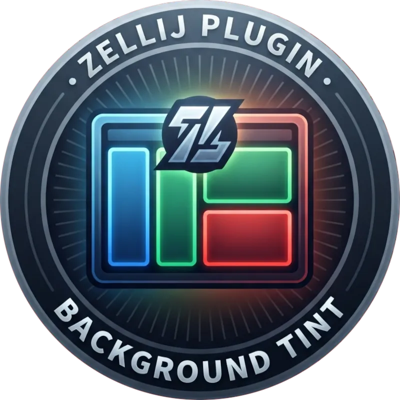
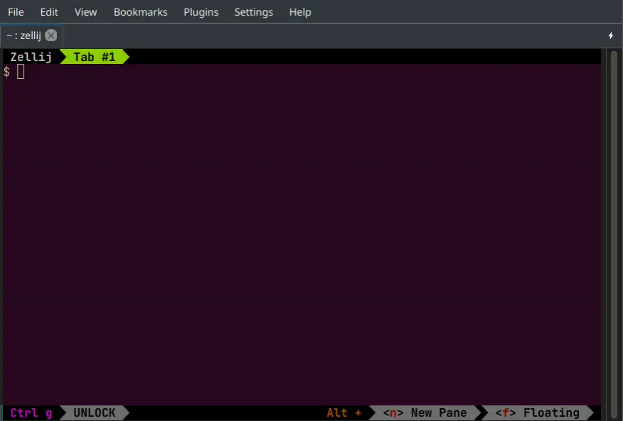

# zellij-background-tint

A handy headless Zellij plugin that gives every terminal pane you create a subtly different
background derived from your existing theme.

It reads the active theme's background color and applies a small, per-pane shift to it (hue,
saturation and lightness) so pane boundaries become apparent without replacing your carefully
chosen colors.

## Features

- Tints terminal panes that exist when the plugin starts.
- Tints tiled, floating, stacked, shell, and command panes created later.
- Leaves Zellij UI plugins and its own background plugin pane untouched.
- Preserves panes that already have a `default_bg`, including layout colors.
- Keeps track of used colors to ensure no two panes use identical color.

## How to start?

Please refer to the [documentation](docs/) for detailed instructions on how to install and configure
this plugin.

## License

* Written and copyrighted &copy;2026 by Marcin Orlowski
* This is open-source software licensed under the [MIT license](http://opensource.org/licenses/MIT)
